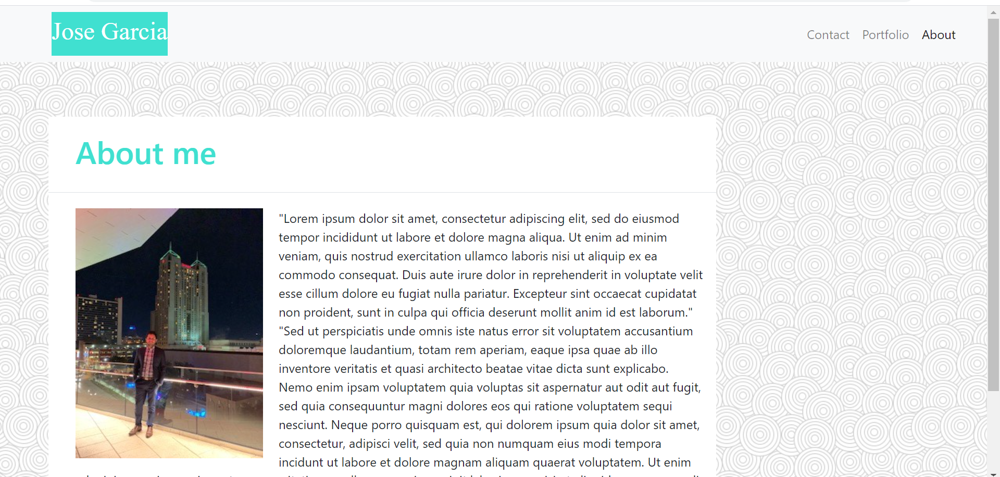
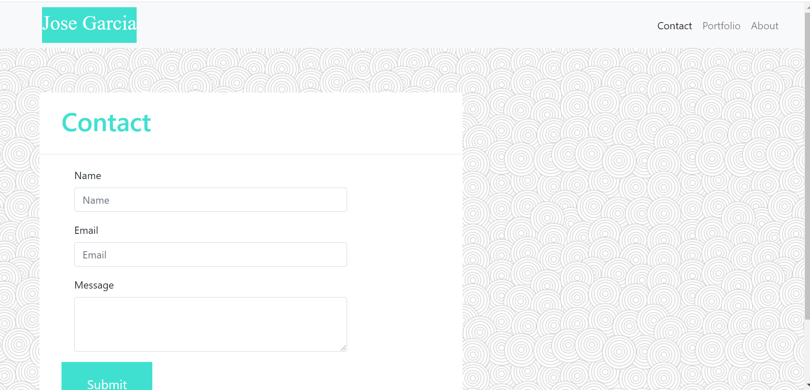
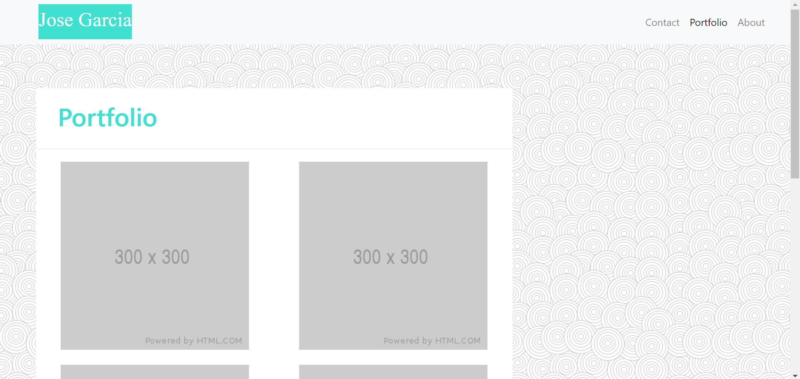

# css-bootstrap

## CSS-Bootstrap Project

This project was to create three pages for a website using the Bootstrap grid layout. The main page is an about me page and the other two are a contact page and portfolio page. Each page included different information so different Bootstrap components had to be used.

The main page include an about me which had a profile picture and a paragraph surrounding the picture. Two rows were built one for the heading and another one for the picture and paragraph. The contact page includes three forms. One for the name, one for the email, and one for a message. It also includes a submit button. A few edits were done in CSS in order to match the design requested in the assignment.

The third page is the portfolio page which only includes a heading and two columns of images. In order to facilitate the arrangement and responsiveness of the images, one column and three rows were used to build the Bootstrap grid layout for this page

All three pages have the same navigation bar which is already responsive. All three pages are responsive too since the Bootstrap CDN is imported into the pages. A ver low number of media queries were needed to facilitate better readability in some of the pages.

Below are screenshots of all three pages:

## Technologies Used

* HTML
* CSS
* Bootstrap

## URL 

Here is the link to the live website:

https://chavalk.github.io/css-bootstrap/

## Contact Information

Email: chavalk@hotmail.com